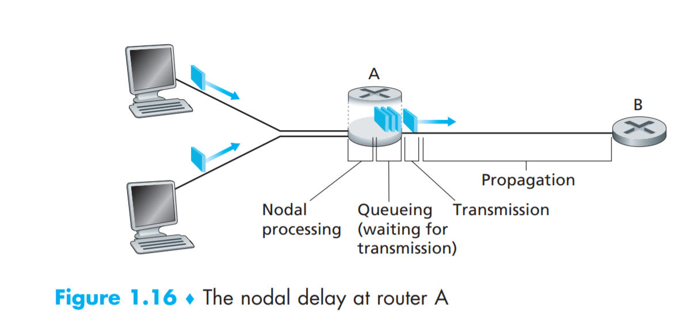
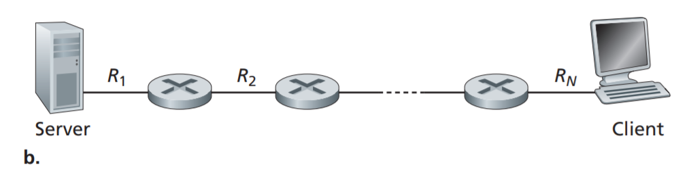
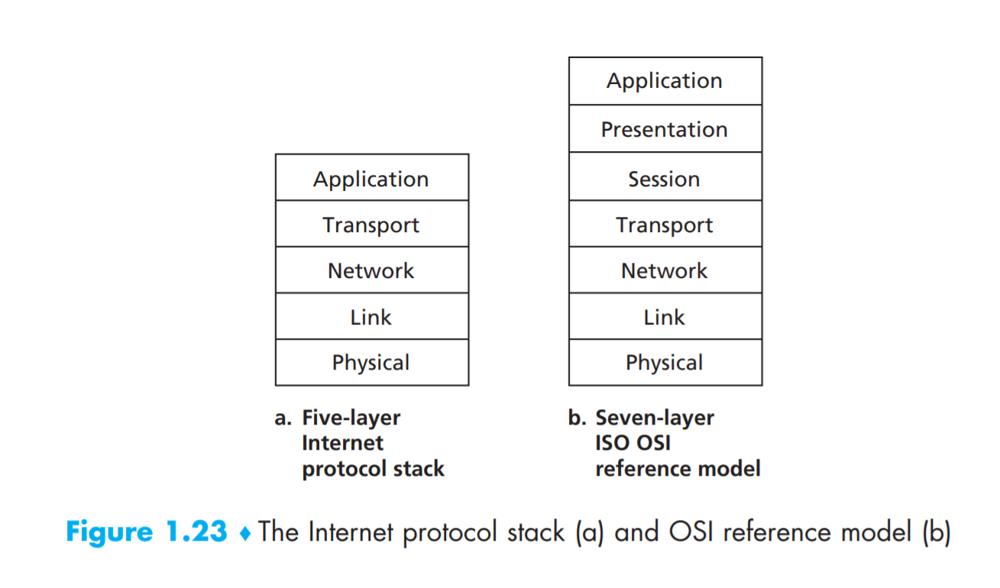

---
attachments:
  [
    Clipboard_2020-06-28-18-23-03.png,
    Clipboard_2020-06-28-20-56-31.png,
    Clipboard_2020-06-28-21-19-46.png,
    Clipboard_2020-06-28-21-20-47.png,
    Clipboard_2020-06-28-21-23-33.png,
    Clipboard_2020-06-28-21-46-15.png,
  ]
favorited: true
tags: [CN]
title: Computer Networks
created: "2020-06-28T10:17:02.521Z"
modified: "2020-06-29T07:33:32.348Z"
---

# COMPUTER NETWORKING A Top-Down Approach

## Chapter 1

- 1.1.1 A Nuts-and-Bolts Description

  - End systems are connected together by a network of **communication links** and
    **packet switches**.

  - Cisco predicts annual global IP traffic will pass the zettabyte (&10^21& bytes) threshold by the end of 2016, and will reach 2 zettabytes per year by 2019 [Cisco
    VNI 2015].

  - End systems, packet switches, and other pieces of the Internet run **protocols** that
    control the sending and receiving of information within the Internet.

- 1.1.3 What Is a Protocol?
  A **protocol** defines the format and the order of messages exchanged between two or more communicating entities, as well as the actions taken on the transmission and/or receipt of a message or other event.

- 1.2.1

  - Digital Subscriber Line (**DSL**) modem uses the existing telephone line (twistedpair copper wire) to exchange data with a digital subscriber line access multiplexer (**DSLAM**) located in the telco’s local central office (**CO**).
  - On the customer side, a splitter separates the data and telephone signals arriving to the home and forwards the data signal to the **DSL** modem.
  - On the telco side, in the CO, the **DSLAM** separates the data and phone signals and sends the data into the Internet.
  - cable Internet access makes use of the cable television company’s infrastructure. Because both fiber and coaxial cable are employed in this system, it is often referred to as hybrid fiber coax(**HFC**)
  - the cable modem termination system (**CMTS**) serves a similar function as the DSL network’s DSLAM.
  - fiber to the home (**FTTH**) - the **FTTH** concept is simple—provide an optical fiber path from the CO directly to the home.
  - fiber is split near to the customer home with either active optical networks (**AONs**) or passive optical networks (**PONs**).
  - Each home has an optical network terminator (_ONT_), which is connected by dedicated optical fiber to a neighborhood splitter which connects to an optical line terminator (_OLT_) in the telco’s CO.

- 1.2.2 Physical Media

  - Physical media fall into two categories: **guided media** and **unguided media**.
  - guided media, such as a fiber-optic cable, a twisted-pair copper wire, or a coaxial cable.
  - unguided media, such as in a wireless LAN or a digital satellite channel.

- 1.3.1 Packet Switching

  - transmission rate is R &(bits)/sec&, if we send L bits time to transmit is &L/R& seconds.
  - **Store-and-forward transmission** means that the packet switch must receive the entire packet before it can begin to transmit the first bit of the packet onto the outbound link.
  - **routing** determines source destination route taken by packets.
  - **forwarding** move packets from routers input to appropiate route output.

- 1.3.2 Circuit Switching

  - There are two fundamental approaches to moving data through a network of links and switches: **circuit switching** and **packet switching**
  - A circuit in a link is implemented with either **frequency-division multiplexing (FDM)** or **time-division multiplexing (TDM)**.
  - With **FDM**, each circuit continuously gets a fraction of the bandwidth. With **TDM**, each circuit gets all of the bandwidth periodically during brief intervals of time (that is, during slots)
  - Proponents of packet switching have always argued that circuit switching is wasteful because the dedicated circuits are idle during **silent periods**.

- 1.3.3 A Network of Networks

  - A **PoP** is simply a group of one or more routers (at the same location) in the provider’s network where customer ISPs can connect into the provider ISP.
  - Any ISP(except Tier-1) may choose to **multi-home**, that is, to connect to two or more provider ISPs
  - A pair of ISP's can **peer**, that is, they can directly connect their networks together
  - A &3^(rd)& party can create an **Internet Exchange Point (IXP)**, which is a meeting point where multiple ISPs can peer together.

- 1.4.1 Overview of Delay in Packet-Switched Networks

  - 
  - &d*(nodal)=d*(proc)+d*(queue)+d*(trans)+d\_("prop")&
  - The time required to examine the packet’s header and determine where to direct the packet is part of the **processing delay**.
  - At the queue, the packet experiences a **queuing delay** as it waits to be transmitted onto the link.
  - The **transmission delay** is &L/R&. This is the amount of time required to push (that is, transmit) all of the packet’s bits into the link.
  - Once a bit is pushed into the link, it needs to propagate to router &B&. The time required to propagate from the beginning of the link to router &B& is the **propagation delay**, i.e, &d/s&, where &d& is the distance between router &A& and router &B& and &s& is the propagation speed of the link.
  - The **transmission delay** is the amount of time required for the router to push out the packet; it is a function of the packet’s length and the transmission rate of the link, but has nothing to do with the distance between the two routers. The **propagation delay**, on the other hand, is the time it takes a bit to propagate from one router to the next; it is a function of the distance between the two routers, but has nothing to do with the packet’s length or the transmission rate of the link.

- 1.4.2 Queuing Delay and Packet Los

  - let &a& denote the average rate at which packets arrive at the queue (&a& is in units of packets/sec). The ratio &(La)/R&, called the traffic intensity.
  - if If &(La)/R& > 1: then queueing delay &->infty&
  - &therefore& _Design your system so that the traffic intensity is no greater than 1._

- 1.4.3 End-to-End Delay

  - Suppose there are &N - 1& routers between the source host and the destination host. with some other supposations we have,
    &d*(end-end)=N(d*(proc)+d*(trans)+d*("prop"))&

- 1.4.4 Throughput in Computer Networks

  - The **instantaneous throughput** at any instant of time is the rate (in bits/sec) at which Host &B& is receiving the file.
  - If the file consists of &F& bits and the transfer takes &T& seconds for Host &B& to receive all &F& bits, then the average throughput of the file transfer is &F/T& bits/sec.
  - 

  - Throughput for a file transfer from server to client is &min{R_1, R_2, ..., R_N}&, which is once again the transmission rate of the bottleneck link along the path between server and client.

- 1.5.1 Layered Architecture
  - 
  - Application Layer:
    - We’ll refer to this packet of information at the application layer as a **message**.
      Examples includes HTTP, SMTP, FTP, etc
  - Transport Layer:
    - we’ll refer to a transport-layer packet as a **segment**.
      Examples includes TCP, UDP
  - Network Layer:
    - responsible for moving packets known as **datagrams** from one host to another
      Examples includes IP
  - Link Layer:
    - we’ll refer to the linklayer packets as **frames**.
      Examples of linklayer protocols include Ethernet, WiFi, and the cable access network’s DOCSIS protocol
  - Physical Layer:
    - the job of the physical layer is to move the individual bits within the frame from one node to the next.
      The protocols in this layer are again link dependent and further depend on the actual transmission medium of the link (for example, twisted-pair copper wire, single-mode fiber optics)
